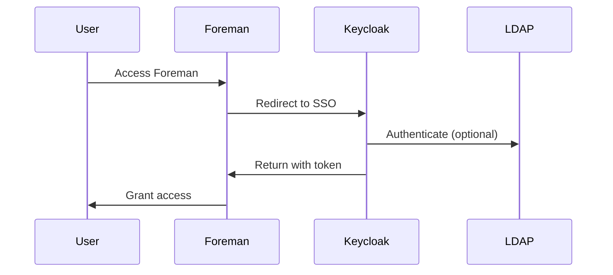

# Foreman SSO Integration Guide

## Integration Architecture



## Configuration Steps

### 1. Foreman Configuration

1. Install the required gem:
   ```bash
   foreman-installer --enable-foreman-plugin-auth-keycloak
   ```

2. Configure the plugin:
   ```yaml
   # /etc/foreman/plugins/foreman_auth_keycloak.yaml
   :keycloak:
     :client_id: foreman
     :client_secret: your_client_secret
     :realm: foreman
     :site: https://keycloak.example.com
     :ssl_verify: true
   ```

3. Restart Foreman:
   ```bash
   systemctl restart foreman
   ```

### 2. Keycloak Client Configuration

1. Create new client:
   - Client ID: foreman
   - Client Protocol: openid-connect
   - Access Type: confidential
   - Valid Redirect URIs: https://foreman.example.com/users/auth/keycloak/callback
   - Web Origins: https://foreman.example.com

2. Configure client roles:
   ```yaml
   roles:
     - foreman-admin
     - foreman-user
     - foreman-viewer
   ```

### 3. User Mapping

1. Configure attribute mapping:
   ```yaml
   # /etc/foreman/plugins/foreman_auth_keycloak.yaml
   :attribute_mapping:
     :login: preferred_username
     :firstname: given_name
     :lastname: family_name
     :mail: email
   ```

2. Configure role mapping:
   ```yaml
   # /etc/foreman/plugins/foreman_auth_keycloak.yaml
   :role_mapping:
     :admin: foreman-admin
     :user: foreman-user
     :viewer: foreman-viewer
   ```

## Testing the Integration

### 1. Basic Testing

```bash
# Test Keycloak connection
curl -v https://keycloak.example.com/realms/foreman/.well-known/openid-configuration

# Test Foreman SSO endpoint
curl -v https://foreman.example.com/users/auth/keycloak
```

### 2. User Flow Testing

1. Access Foreman
2. Click "Sign in with Keycloak"
3. Enter credentials
4. Verify successful login
5. Check user roles and permissions

## Troubleshooting

### Common Issues

1. **Authentication Failures**
   ```bash
   # Check Foreman logs
   tail -f /var/log/foreman/production.log
   
   # Check Keycloak logs
   tail -f /var/log/keycloak/keycloak.log
   ```

2. **Role Mapping Issues**
   ```bash
   # Verify user roles in Keycloak
   kcadm.sh get users -r foreman
   
   # Check role assignments
   kcadm.sh get users/{user-id}/role-mappings
   ```

3. **SSL/TLS Issues**
   ```bash
   # Verify certificates
   openssl s_client -connect keycloak.example.com:443
   ```

## Security Considerations

### 1. SSL/TLS Configuration

```yaml
# /etc/foreman/plugins/foreman_auth_keycloak.yaml
:ssl_verify: true
:ssl_ca_file: /etc/foreman/certs/ca.pem
```

### 2. Token Validation

```yaml
# /etc/foreman/plugins/foreman_auth_keycloak.yaml
:token_validation:
  :verify_audience: true
  :verify_issuer: true
  :verify_expiration: true
```

### 3. Session Management

```yaml
# /etc/foreman/plugins/foreman_auth_keycloak.yaml
:session:
  :timeout: 3600
  :refresh_interval: 300
```

## Monitoring

### 1. Health Checks

```bash
# Check Foreman SSO status
curl -s https://foreman.example.com/users/auth/keycloak/status

# Check Keycloak health
curl -s https://keycloak.example.com/health/ready
```

### 2. Metrics

```yaml
# /etc/foreman/plugins/foreman_auth_keycloak.yaml
:metrics:
  :enabled: true
  :endpoint: /metrics
```

## Backup and Recovery

### 1. Configuration Backup

```bash
# Backup Foreman SSO configuration
tar -czf foreman_sso_config.tar.gz /etc/foreman/plugins/foreman_auth_keycloak.yaml

# Backup Keycloak client configuration
kcadm.sh get clients/foreman -r foreman > keycloak_client_config.json
```

### 2. Recovery Procedure

```bash
# Restore Foreman configuration
tar -xzf foreman_sso_config.tar.gz -C /

# Restore Keycloak client
kcadm.sh create clients -r foreman -f keycloak_client_config.json
``` 