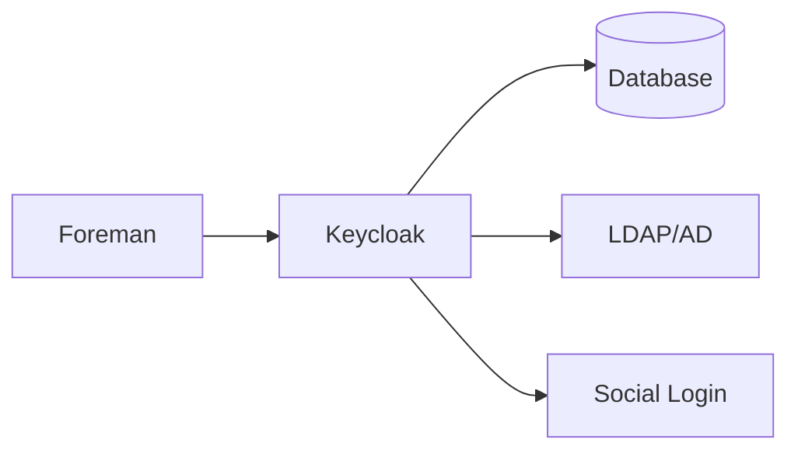

# Keycloak Technical Setup Guide

## Architecture Overview



## Detailed Installation Steps

### 1. System Requirements

- Java 17 or higher
- 4GB RAM minimum
- 10GB disk space
- Open ports:
  - 8080 (HTTP)
  - 8443 (HTTPS)
  - 9990 (Management)

### 2. Database Configuration

Keycloak supports multiple databases. For production:

```yaml
# PostgreSQL Configuration
db: postgres
db-url: jdbc:postgresql://localhost:5432/keycloak
db-username: keycloak
db-password: your_secure_password
```

### 3. SSL/TLS Configuration

For production environments:

```yaml
# SSL Configuration
https-port: 8443
https-client-auth: none
https-cipher-suites: TLS_AES_128_GCM_SHA256,TLS_AES_256_GCM_SHA384
```

### 4. High Availability Setup

For HA deployment:

1. Configure database clustering
2. Set up load balancer
3. Configure session replication
4. Set up monitoring

## Security Hardening

### 1. Password Policies

```yaml
# Password Policy Configuration
password-policy:
  length: 12
  digits: 1
  uppercase: 1
  lowercase: 1
  special: 1
  history: 5
```

### 2. Session Management

```yaml
# Session Configuration
session:
  idle: 30m
  max: 24h
  sso-idle: 10m
  sso-max: 24h
```

### 3. Brute Force Protection

```yaml
# Brute Force Protection
brute-force-detection:
  enabled: true
  max-failures: 5
  wait-increment: 60
  max-wait: 900
```

## Monitoring

### 1. Metrics Collection

```yaml
# Metrics Configuration
metrics:
  enabled: true
  prefix: keycloak_
  endpoint: /metrics
```

### 2. Logging

```yaml
# Logging Configuration
logging:
  level: INFO
  handlers:
    - type: file
      path: /var/log/keycloak/keycloak.log
      level: INFO
    - type: console
      level: WARN
```

## Backup and Recovery

### 1. Database Backup

```bash
# PostgreSQL Backup
pg_dump -U keycloak -d keycloak > keycloak_backup.sql

# Restore
psql -U keycloak -d keycloak < keycloak_backup.sql
```

### 2. Configuration Backup

```bash
# Backup Configuration
tar -czf keycloak_config.tar.gz /opt/keycloak/conf/

# Restore Configuration
tar -xzf keycloak_config.tar.gz -C /opt/keycloak/
```

## Troubleshooting Guide

### Common Issues

1. **Database Connection Issues**
   ```bash
   # Check database connection
   psql -h localhost -U keycloak -d keycloak
   
   # Verify database status
   systemctl status postgresql
   ```

2. **Memory Issues**
   ```bash
   # Check memory usage
   free -m
   
   # Adjust JVM settings
   export JAVA_OPTS="-Xms512m -Xmx1024m"
   ```

3. **SSL/TLS Issues**
   ```bash
   # Verify certificate
   openssl x509 -in /path/to/cert.pem -text -noout
   
   # Test SSL connection
   openssl s_client -connect localhost:8443
   ```

## Performance Tuning

### 1. JVM Settings

```bash
# Production JVM Settings
export JAVA_OPTS="-Xms2g -Xmx4g -XX:MetaspaceSize=96M -XX:MaxMetaspaceSize=256m"
```

### 2. Database Tuning

```sql
-- PostgreSQL Tuning
ALTER SYSTEM SET max_connections = '200';
ALTER SYSTEM SET shared_buffers = '1GB';
ALTER SYSTEM SET effective_cache_size = '3GB';
```

## Maintenance Procedures

### 1. Regular Maintenance

```bash
# Weekly Tasks
- Check logs for errors
- Verify backup status
- Monitor disk usage
- Review security logs
```

### 2. Update Procedures

```bash
# Update Steps
1. Backup database and configuration
2. Stop Keycloak service
3. Update Keycloak
4. Verify configuration
5. Start service
6. Test functionality
```

## Ansible Installation

This project provides an automated Ansible-based installation for Keycloak:

```bash
# Install required collections
ansible-galaxy collection install -r requirements.yml

# Run the playbook
ansible-playbook -i inventory.yml site.yml
```

### Inventory Configuration

Your inventory should look like this for remote installation:

```ini
[foreman]
foremanserver.mydomain.com ansible_host=192.168.2.1
```

Or like this for local installation:

```ini
[foreman]
foremanserver.mydomain.com ansible_connection=local
```

### Variables Configuration

Key variables can be configured in `host_vars/foreman_vars.yml`:

```yaml
# Keycloak version and configuration
keycloak_version: "21.1.1"
keycloak_admin_user: "admin"
keycloak_admin_password: "your-secure-password"
keycloak_https_port: 8443

# Foreman realm and client
foreman_realm_name: "foreman"
foreman_client_id: "foreman"
``` 